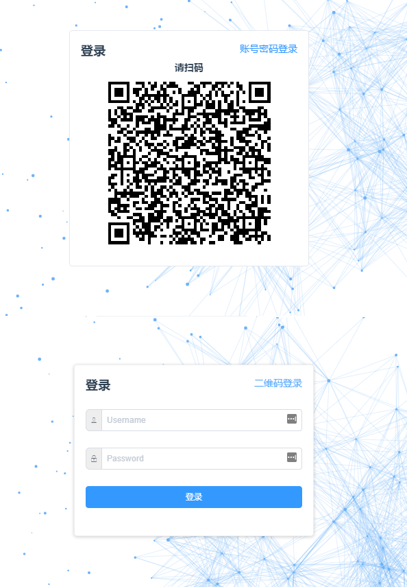
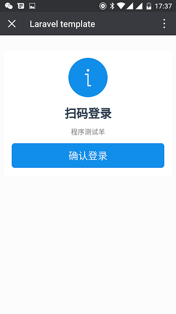
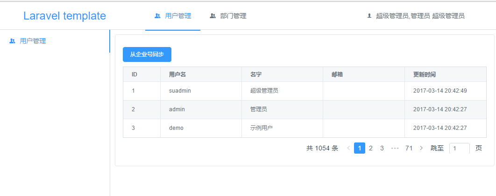

Laravel 5.4 RESTful 应用模板，包含企业号同步联系人，扫码登录，使用 Vue2 iView 做前端
===============================
[](https://packagist.org/packages/purocean/laravel-template)
[](https://packagist.org/packages/purocean/laravel-template)
[](https://packagist.org/packages/purocean/laravel-template)
[](https://packagist.org/packages/purocean/laravel-template)

特性
-------------------
+ [x] 微信企业号同步联系人
+ [x] 扫码登录
+ [x] Vue2 iView 前端界面
+ [x] 文件上传处理
+ [x] 微信 jssdk
+ [x] RESTful

建议环境
-------------------
+ [x] PHP 7.0+
+ [x] Composer
+ [x] Redis
+ [x] Mysql 5.7
+ [x] MongoDB 3.2+

安装
-------------------
```bash
composer install
cp .env.example .env
vim ./.env # 配置数据库，企业微信，缓存等信息
php ./artisan key:generate
php ./artisan jwt:secret
php ./artisan migrate # 迁移表结构
php ./artisan rbac:resetpwd suadmin <password> # 更改超级管理员密码
php ./artisan serve --host=192.168.1.108 # 运行开发服务器，IP 为本机局域网 IP，以便手机访问（扫码）
php ./artisan queue:work # 开启任务队列进程
composer run-script make-api-doc # 生成接口文档

cd frontend
npm install # 安装 nodejs 依赖
cp ./config/index.js.example ./config/index.js
vim ./config/index.js # 修改本机后台服务器 IP 端口
npm run dev # 运行开发服务器
npm run build # 前端打包
npm run dist # 把打包的文件复制到 public 目录
# npm run dist-win # 把打包的文件复制到 public 目录，windows 平台使用
```

测试
-------------------
```bash
php ./artisan config:clear # 清除配置缓存
composer exec phpunit # 开始测试
```

注意事项
-------------------
+ 若微信调试不通过，可在 /storage/app/qywx/qywx.log 查看日志，删除缓存文件
+ 请使用PHP7 以及开启 OPcache 提高性能
+ storage 及其目录需要有写入权限
+ 任务队列默认是 sync 方式，可在 .env 文件中修改为 redis 方式
+ 如非必要，队列不要用 root 权限执行

链接
-------------------
+ [Laravel - The PHP Framework For Web Artisans](https://laravel.com/)
+ [Laravel 5.4 中文文档](http://d.laravel-china.org/docs/5.4)
+ [vue.js](https://cn.vuejs.org/)
+ [iView - 一套高质量的UI组件库](https://www.iviewui.com/)
+ [dingoapi](https://github.com/dingo/api)
+ [jwt-auth](https://github.com/tymondesigns/jwt-auth)
+ [ENTRUST](https://github.com/Zizaco/entrust)

截图
-------------------



